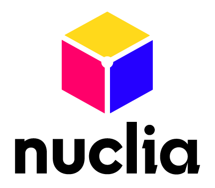

<!--- BADGES: START --->
[](https://huggingface.co/nuclia)
[][#github-license]
[][#pypi-package]
[][#pypi-package]
[](https://github.com/nuclia/nuclia-eval/actions)


[#github-license]: https://github.com/nuclia/nuclia-eval/blob/master/LICENSE
[#pypi-package]: https://pypi.org/project/nuclia-eval/
<!--- BADGES: END --->

# nuclia-eval
<p align="center">
  
</p>

Library for evaluating RAG using Nuclia's models

Its evaluation follows the RAG triad as proposed by [TruLens](https://www.trulens.org/trulens_eval/getting_started/core_concepts/rag_triad/):


In summary, the metrics **nuclia-eval** provides for a RAG Experience involving a **question** an **answer** and N pieces of **context** are:

* **Answer Relevance**: Answer relevance refers to the directness and appropriateness of the response in addressing the specific question asked, providing accurate, complete, and contextually suitable information.
    * **score**: A score between 0 and 5 indicating the relevance of the answer to the question.
    * **reason**: A string explaining the reason for the score.
* For each of the N pieces of context:
    * **Context Relevance Score**: The context relevance is the relevance of the **context** to the **question**, on a scale of 0 to 5.
    * **Groudedness Score**: Groundedness is defined as the degree of information overlap to which the **answer** contains information that is substantially similar or identical to that in the **context** piece. The score is between 0 and 5.

## Available Models

### REMi-v0

[REMi-v0](https://huggingface.co/nuclia/REMi-v0) (RAG Evaluation MetrIcs) is a LoRa adapter for the 
[Mistral-7B-Instruct-v0.3](https://huggingface.co/mistralai/Mistral-7B-Instruct-v0.3) model. 

It has been finetuned by the team at [**nuclia**](nuclia.com) to evaluate the quality of the overall RAG experience.

## Usage

```python
from nuclia_eval import REMi

evaluator = REMiEvaluator()

...
```